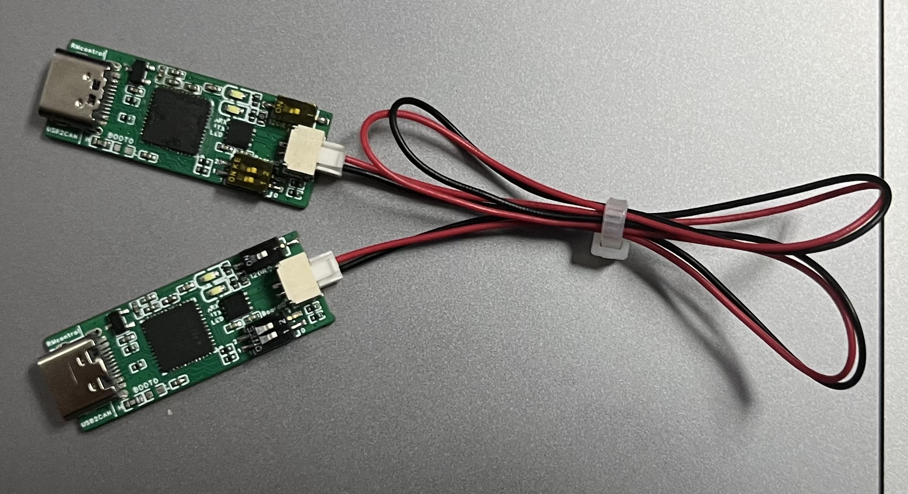

## 这里会教大家如何使用 C++ 与电机进行 can 通信
对于 can 通信是什么，我们这里不过多赘述，大家可以自行上网搜索了解（ 当然，作为 RMer，我们要具有工程思维，只要粗浅了解原理，会用即可。这也得益于我们硬件组的同学，为我们提供了良好的条件，可以即插即用的 usb2can ）（ 同时，本章节需要感谢 DynamicX 开源的 usb2can 仓库 ）

## 使用 usb2can
首先进行软件更新
```
sudo apt-get update && sudo apt-get -y upgrade
```
安装所需依赖软件包
```
sudo apt-get install -y can-utils net-tools
```
将两个 usb2can 如图连接起来，并同时和自己的电脑连接，即可进行回环测试



查看是否检测到 can 设备（ 在列表中看到带有 can 名称的设备说明你的电脑正常识别了 can 设备 ）
```
ifconfig -a
```
进行 can 设备初始化（ 示例为初始化 can0 和 can1 ）
```
sudo ip link set can0 up type can bitrate 1000000
```
```
sudo ip link set can1 up type can bitrate 1000000
```
打开 Terminal，用来监测 can0 接受到的报文
```
candump can0
```
再打开一个 Terminal 窗口使用 can1 来进行发送数据
```
cansend can1 200#5A5A5A5A5A5A5A5A
```
如果可以在 `candump can0` 的 Terminal 里看到如下信息，则说明正常工作
```
can0 200 [8] 5A 5A 5A 5A 5A 5A 5A 5A
```

## 如何使用 linux / can.h 进行 can 的收发

