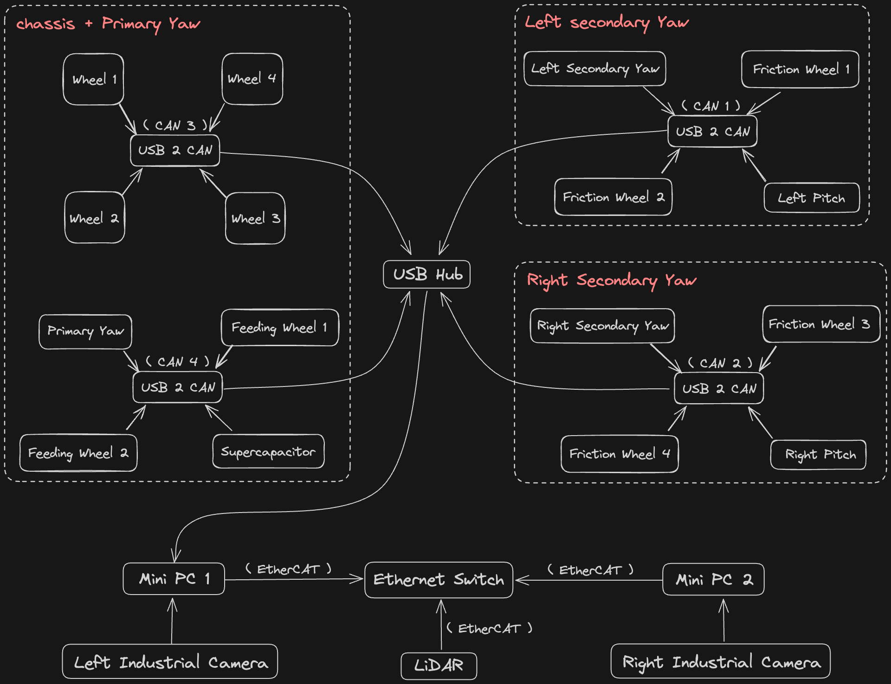
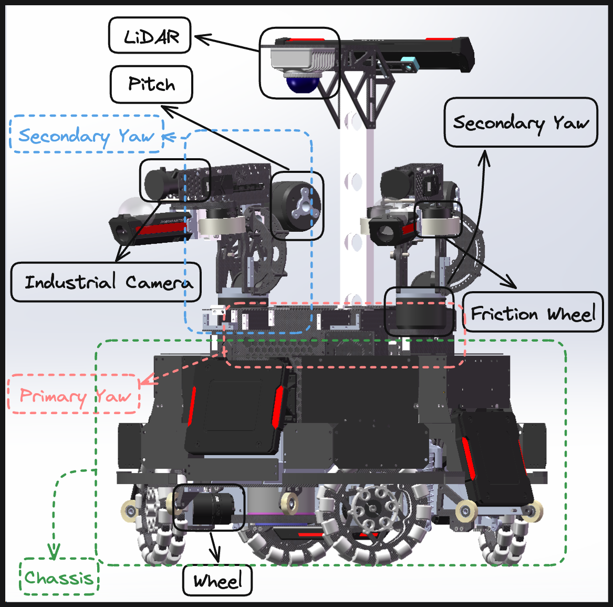
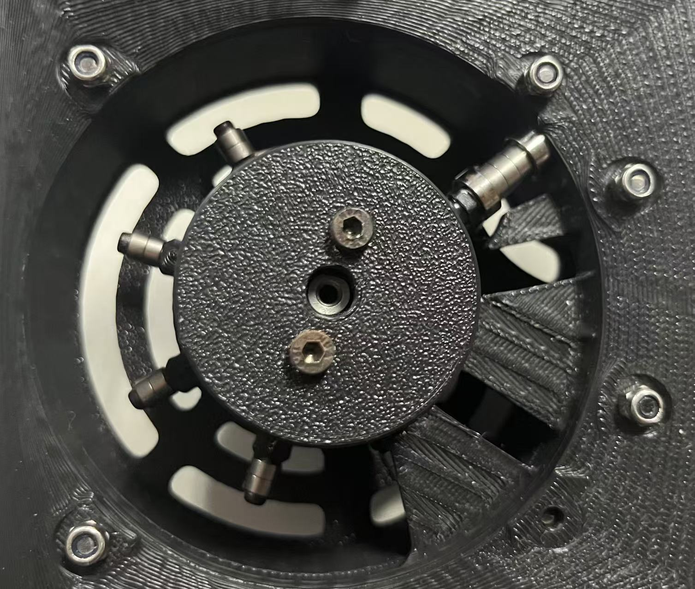

## 这里会教大家我们机器人上的线路拓扑
以双头哨兵为例，我们车上的线路拓扑图主要如下

+ 关于代码部分，左小 yaw 视觉和控制代码跑在 Mini PC 1 上，右小 yaw 视觉和 LiDAR 导航代码跑在 Mini PC 2 上

对于上图中各部分的实际 3D 模型如下

+ Secondary Yaw 是我们俗称的小 yaw，图上出现了两个 Secondary Yaw 是因为蓝色虚线框代表的是整个小 yaw 机构，而黑色实线框代表的是小 yaw 电机（ 在整张图中虚线框均代表由多部分组成的机构，而实线框是单个电机或设备 ）
+ Primary Yaw是我们俗称的大 yaw，至于大 yaw 和小 yaw 是干什么的？小 yaw 固定在大 yaw 上，需要整体大幅度移动的会选择让大 yaw 移动，而在自瞄敌方小陀螺的过程中，只需要让小 yaw 进行小幅度移动就可以，这样可以获得更高的响应速度
+ 图上缺少了大 yaw 电机和 Feeding whee（ 拨弹轮电机 ）的标注，大 yaw 电机大家可以类比小 yaw 机构和小 yaw 电机，唯一不同的是大 yaw 电机会使用同步带作为传动机构
  
拨弹轮的实物图如下

+ 拨弹轮内部会有一个电机带动拨齿旋转，从而将弹丸推向头部的 Friction Wheel（ 拨弹轮 ）将弹丸发射出去

