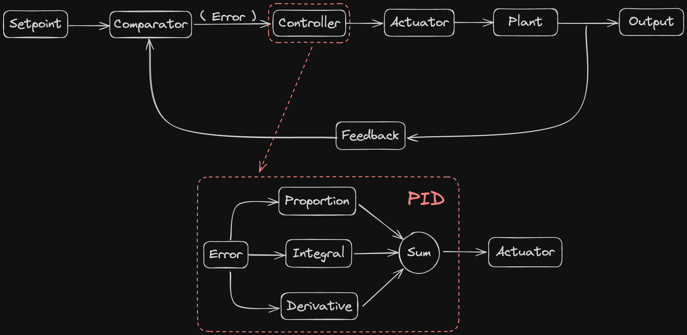

## 这里会教大家闭环控制和 PID 算法
本文档主要分为三个部分：算法原理、科学调参、控制代码

## 算法原理
首先一个闭环控制系统如下

+ 首先我们需要设定一个我们期望经过控制达到的值，即期望值（ Setpoint ）
+ 通过比较器（ Comparator ）与现在系统的输出值（ Output ）的反馈（ Feedback ）进行比较，得到误差（ Error ），告诉控制器（ Controller ）现在距离目标值还差多少
+ 控制器再让执行器（ Actuator ）对设备（ Plant ）进行执行
+ 通过不断的控制，执行，反馈，控制，执行，反馈逼近期望值

在 Controller 中最重要的即是 PID 控制算法
+ 比例（ Proportion ）的作用是解决控制器和执行器之间量纲不统一的影响，比如我们的目的是让电机的转速达到 1200rpm，但可能我们控制电机是需要给电机发送电流值
+ 积分（ Integral ）的作用是消除稳态误差，可以将过去的误差进行累积。从而消除系统长期的偏差。例如在电机带有负载时，达到稳态后比例项给的小电流可能无法让电机转动，但加入积分项后，可以过去时刻的误差累积起来，从而使电流变大，逐渐缩小误差。但我们应当注意的是，要给积分设定一个上限，防止因为电机堵转之类的情况导致积分项持续增加
+ 微分（ Derivative ）的作用是抑制系统的快速变化，类似于阻尼的效果，其本质是当前时刻和过去时刻误差的差，当误差在减小时，微分项会变成负数，以此来防止比例项和积分项使系统超调过多
+ 最后再将比例项、积分项、微分项进行相加，得到需要传给执行器的值
## 科学调参

## 控制代码

